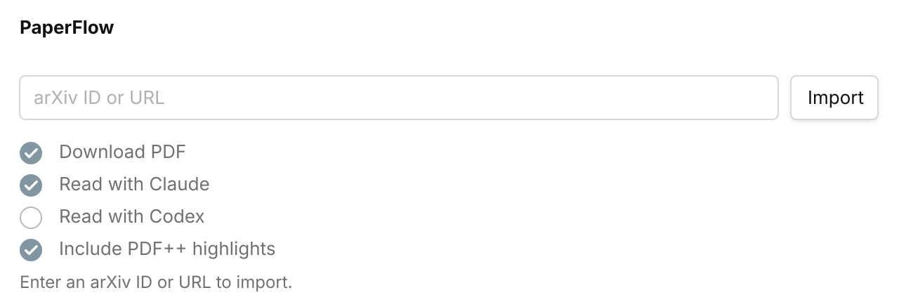
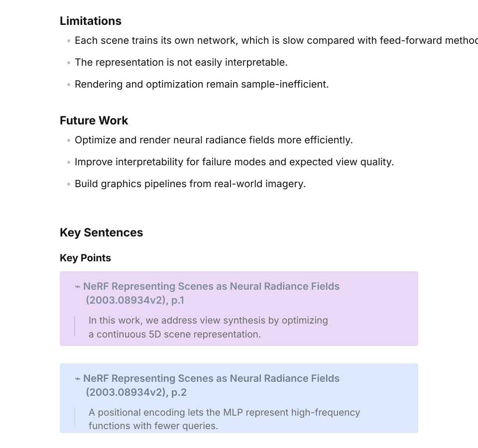

# PaperFlow

PaperFlow turns arXiv links into Obsidian paper notes, PDFs, AI summaries, and
PDF++ highlights.



## What It Does

- Import from arXiv IDs or arXiv URLs.
- Download PDFs and create Markdown notes in `Raw` by default.
- Read papers with Claude Code or Codex.
- Generate concise sections for idea, method, limitations, future work, and key sentences.
- Add exact-match PDF++ highlights with configurable concepts and colors.

## Installation

### Community Plugin

Enable community plugins in Obsidian and search for `PaperFlow`.

### Manual Install

Create this folder in your vault:

```text
Your Vault/.obsidian/plugins/paperflow
```

Download `main.js`, `manifest.json`, and `styles.css` from a release and place
them in that folder. Then enable `PaperFlow` from Obsidian's Community
plugins settings.

### Local Development Install

```bash
npm install
npm run build
cp manifest.json main.js styles.css "Your Vault/.obsidian/plugins/paperflow/"
```

Reload Obsidian or disable and re-enable the plugin after copying files.

## Usage

Open the command palette and run one of:

- `PaperFlow: Import metadata and PDF from arXiv`
- `PaperFlow: Import metadata only from arXiv`

Enter an arXiv ID or URL, then press Enter or click `Import`.

Supported inputs:

```text
1703.06870
arXiv:1703.06870
https://arxiv.org/abs/1703.06870
https://arxiv.org/pdf/1703.06870
```

PaperFlow shows progress, supports canceling, and opens the generated note when
the import finishes.

## Settings

Open `Settings -> PaperFlow`.

- `PDF folder`: folder for downloaded PDFs.
- `Note folder`: folder for generated Markdown notes.
- `Custom template file`: optional custom note template path.
- `Read with Claude`: run local Claude Code after PDF download.
- `Claude command`: optional Claude CLI path. Empty tries common locations.
- `Read with Codex`: run local Codex after PDF download.
- `Codex command`: optional Codex CLI path. Empty tries common locations.
- `Include PDF++ highlights`: add best-effort PDF++ `selection=` ranges to AI
  key-sentence callouts. Default is off.
- `PDF++ highlight concepts`: add/remove concept headings and choose each
  highlight color with a hex color picker.
- `Reading prompt`: shared prompt template used by Claude and Codex.

## AI Reading

When `Read with Claude` or `Read with Codex` is enabled, PaperFlow appends a
short reading section:

- `Idea`
- `Method`
- `Limitations`
- `Future Work`
- `Key Sentences`

The reading prompt supports these placeholders:

```text
{{ reader }}
{{ pdf_full_path }}
{{ pdf_vault_path }}
{{ pdf_name }}
{{ pdf_title }}
{{ title }}
{{ paper_id }}
{{ authors }}
{{ abstract }}
{{ pdf_text }}
```

`{{ pdf_text }}` is mainly for Codex. PaperFlow extracts bounded PDF text locally
with `pdftotext`.

## PDF++ Highlights

AI key sentences can become PDF++ callouts:

```markdown
> [!PDF|yellow] [[Paper Title.pdf#page=1&color=yellow|Paper Title, p.1]]
> > quoted sentence
```

With `Include PDF++ highlights`, PaperFlow locates exact quoted sentences in the
PDF text layer and adds a PDF++ `selection=` range:

```markdown
> [!PDF|yellow] [[Paper Title.pdf#page=1&selection=20,87,22,100&color=yellow|Paper Title, p.1]]
> > quoted sentence
```

If a sentence cannot be matched uniquely, PaperFlow keeps the page-only link
instead of creating a wrong highlight.



## Metadata And Network Behavior

The plugin uses `https://arxiv.org/abs/<id>` first and reads citation metadata
from the abstract page. The slower legacy Atom API is only used as a fallback.

Timeouts:

- arXiv abstract page metadata: 15 seconds.
- arXiv API fallback metadata: 15 seconds.
- PDF download: 120 seconds.
- Codex reading: 420 seconds.

## Custom Note Templates

The generated note can use the built-in template or a custom template file.

Available variables:

- `{{ paper_id }}`: arXiv paper ID.
- `{{ title }}`: paper title.
- `{{ authors }}`: authors as text.
- `{{ date }}`: publication date.
- `{{ abstract }}`: paper abstract.
- `{{ comments }}`: paper comments.
- `{{ pdf_link }}`: downloaded PDF link, or remote PDF URL when no PDF was downloaded.

To use a custom template:

1. Open `Settings -> PaperFlow`.
2. Set `Custom template file`.
3. Click `Create template file`, or create the file yourself.
4. Edit the template in source mode.

## Desktop Requirements

PDF import works in Obsidian desktop and mobile, but AI reading requires desktop
because it runs local CLI tools.

Optional tools:

- Claude Code CLI for `Read with Claude`.
- Codex CLI for `Read with Codex`.
- `pdftotext` for Codex text extraction.

## License

MIT
